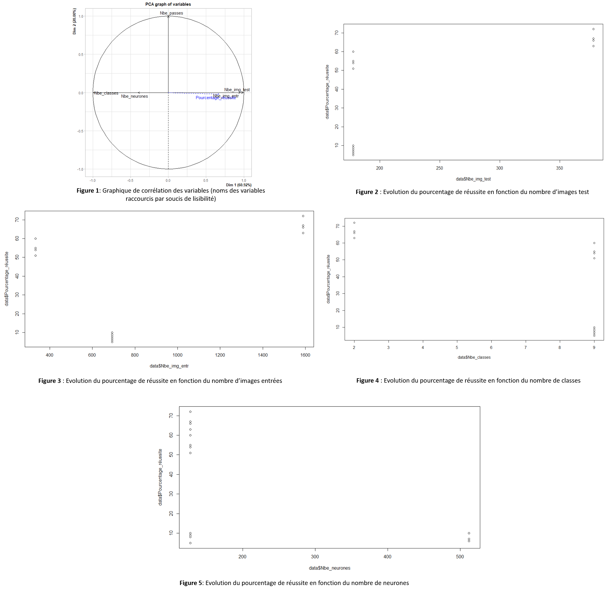

\newpage

# Introduction TP Deap Learning

L'objectif de ce TP est de prendre le contrôle d'unmoteur de recherche (ici FireFoxe) et de créer un réseau neuronal pour que le système aprenne à repérer des images cohérentes de manière précise. 

Nous avons choisi d'étudier le domaine "Animaux de la ferme" avec les catégories suivantes:
vache charolaise, vache aubrac, cochon, cheval, chèvre
 

# 1. D’après le contexte, à quoi correspondent les variables prédictives et cible?

Les variables prédictives sont des images. Les cibles, sont des probabilités d'appartenance à des catégories.
Pour chaque images, le réseau fait des calculs, puis estime un vecteur descripteur de l'image. Ensuite, une ou des dernières couches de réseau entièrement connecté permettent d'estimer à partir de ce vecteur, n probabilité corrrespondant à n classes/catégories d'appartenance de l'image d'entrée. 
La probabilité la plus élevée en sortie, donne la catégorie d'appartenance la plus probable de l'image.


# 2. Récupération d'images sur image_search_scraper.py : remarques

L’IA permet de produire un dossier « raw set » dans dequel on trouve 100 image de chaque catégories correspondant à notre domaine d'étude, trouvées sur le moteur de recherche FireFoxe. 
Ensuite nous trieons manuellement ces images brutes pour enlever les images incohérentes.

En effet, nous remarquons que les images ne correspondent pas toutes à ce qu'on aurait voulu. On ne reçoit pas forcément l'animal vivant mais aussi des dessins et ce n'est pas ce qu'on souhaite apprendre à l'IA. Ce sont ces images qu'ils faut supprimer pour préciser notre demande. 

Lorsque la photo comprenait une partie du corps de l'animal, plusieurs animaux ou un animal avec un homme nous avons supprimées les images pour ne pas induire l'IA en erreur.

Il est en effet important que la base d'apprentissage soit représentative (contiennent des images de toutes les catégories que l'on cherche à prédire), et qu'elle ne comporte pas d'erreurs ou d'ambiguité (image de même catégories, classées dans deux catégories différentes par erreur).


# 3. Proposez une méthode pour réaliser ce travail, puis affichez et interprétez le script Python dataset_splitter.py

Il faut entrainer le système à la reconnaissance d'images avec le « training-set » pour qu’il reconnaisse précisément la demande chèvre en tant que chèvre par exemple.
Pour tester qu’il a bien appris, nous utilisonsle test set pour voir combien d’images il reconnait comme étant réellement une chèvre dans x images de chèvres. 

Il ne faut pas de données présentent dans deux ensembles à la fois. Il faut aussi que les données des ensembles soient représentatives (balaient l'ensemble des catégories possibles).

Le nombre de données de la base d'apprentissage doit être plus important que celui de la base de test.

Les données de la base d'apprentissage servent à mettre à jour les poids du réseau. Les données de la base de test servent à calculer une erreur de prédiction, et ainsi savoir si le réseau à suffisamment appris. 


# 4. Observez et commentez la structure de ce fichier source

La structure du fichier simple_cnn_menu.py se présente ainsi :  

  - une partie définissant la structure du réseau de neurones convolutif (nb de couches, type de couches)  
  
  - une partie mettant en forme les différentes bases (apprentissage, test).  
  
  - une partie lançant l'apprentissage avec le réseau, et les base d'apprentissage et test  
  
  - une dernière partie qualifiant le réseau par estimation en utilisant la base de validation et mesure des erreurs.


# 5. Lancement de l’apprentissage sur le corpus d’apprentissage précédemment créé: remarques:

Normalement , au fur et à mesure des itérations, le taux d'erreur de prédiction doit baisser. 

Voici les résultats que nous avons obtenus avec le domaine étudié:

CNN  multiclass  ( 6 catégories) avec 10 passes  

- cheval  :  5 / 10 ( 50 %)  

- chevre  :  3 / 14 ( 21 %)  

- cochon  :  4 / 11 ( 36 %)  

- poule  :  12 / 17 ( 70 %)  

- vache_aubrac  :  9 / 18 ( 50 %)  

- vache_charolaise  :  4 / 16 ( 25 %)  

- Global :  37 / 86 ( 43 %)   


CNN  multiclass  ( 6 catégories) avec 25 passes  

- cheval  :  5 / 10 ( 50 %)  

- chevre  :  5 / 14 ( 35 %)  

- cochon  :  4 / 11 ( 36 %)  

- poule  :  11 / 17 ( 64 %)  

- vache_aubrac  :  8 / 18 ( 44 %)  

- vache_charolaise  :  5 / 16 ( 31 %)  

- Global :  38 / 86 ( 44 %)  


Nous remarquons en étudiant les statistiques obtenues que le pourcentage de réussite global n'a augmenté que de 1% en faisant plus de 2 fois plus de passes. 
La solution a préférer est donc peut-être d’augmenter le corpus d’image de base (réponse en 6)


# 6. Testez ces différents modèles et interprétez les données du fichier models.csv au moyen de la technique de votre choix (par exemple avec R)

On fait une ACP pour déterminer quels facteurs comptent le plus pour avoir le meilleur pourcentage d’apprentissage. Ensuite selon la réponse de l’ACP on peut tracer des graphiques du pourcentage de réussite en fonction de la/des variables sélectionnées .


```{r logo, echo=FALSE, out.width = '100%', fig.align = "center",fig.cap="Graphique de corrélation des variables (noms des variables raccourcis pour plus de visibilité)"}

```

A la lecture du graphique de corrélation (figure 1) des variables, nous remarquons comme attendu que le pourcentage de réussite est corrélé avec le nombre d'images test et le nombre d'images d'entrainements. 

Nous nous attendions à ce que le pourcentage de réussite soit également corrélé positivement au nombre de neurones. Pourtant il semble qu'ils soient corrélés de manière négative. Il se peut qu'au delà d'un nombre de neurones trop important, le système soit confronté à un surapprentissage: par exemple, Si un réseau est trop entrainé, c'est à dire qu'il arrive surgénéraliser, il est possible qu'en étant entrainé pour reconnaître des animaux de la savane, il arrive à reconnaître un chat comme un lion. Dans ce cas le pourcentage de réussite diminue lorsque le nombre de neurones augmente.

Dans ce cas, nous pensions que le pourcentages de réussite serait corrélé positivement ou négativement au nombre de passes. Or cela ne semble pas être le cas. Cela pourrait signifier que le nombre de passes nécessaire à une reconnaissance optimum doit être déterminé manuellement ("à taton") avec différents essais.

Les graphiques des figures 2 à 5 viennent confirmer l'analyse ACP. 
Sur la figure 2 montrant l'évolution du pourcentage de réussite en fonction du nombre d'images test, on remarque une variation du pourcentage de réussite alors que le nombre d'images test reste à 178. Ce la peut s'expliquer par le nombre de neurones: moins il y a de neurones  plus le pourcentage de réussite est haut (128 neurones pour le pourcentage de réussite haut et 512 quand il est bas). 

Sur la figure 3, on observe un pourcentage de réussite non prévisible (par rapport à l'interprétation de l'ACP) pour 593 images en entrée: on peut expliquer cela par un mauvais tris des images initialement. 

Sur la figure 4, on remarque un fort pourcentagges de réussite par rapport à l'interprétation de l'ACP pour 9 classes. Cela ne correspond pas avec notre interprétation de l'ACP, car dans ce cas il y a 334 images en entrées lorsque le pourcentage est haut et 693 lorsque le pourcentage est bas: nous nous attendions à l'inverse). Il doit y avoir un facteur autre que l'on ne sait pas interpréter ou encore un problème de tri.

Sur la figure 5, les variations correspondent à l'interprétation de l'ACP: plus il y a de neurones et moins le pourcentage de réussite est grand. Toutefois nous observons encore quelques valeurs abhérantes à 128 neurones qui présentent un pourcentage de réussite faible. On se rend compte que c'est le même cas de figure que pour la figure 4. Peut être que notre ACP n'est pas correcte. 

\newpage


